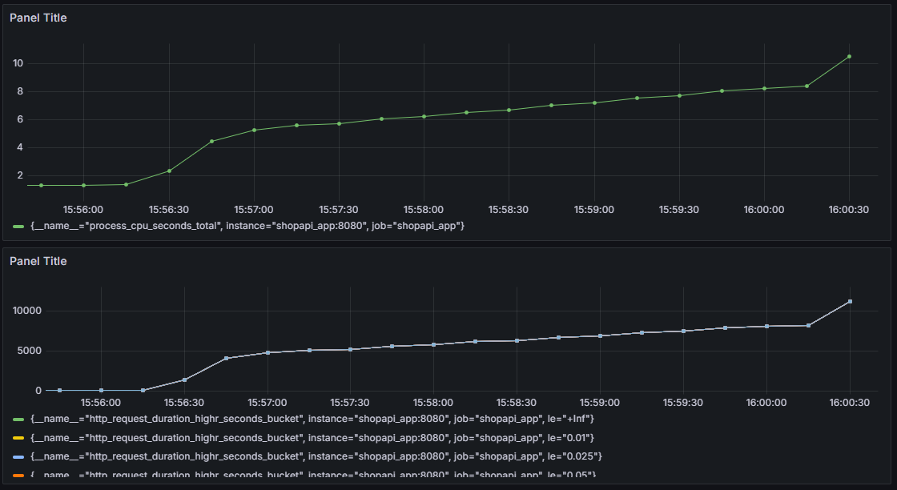
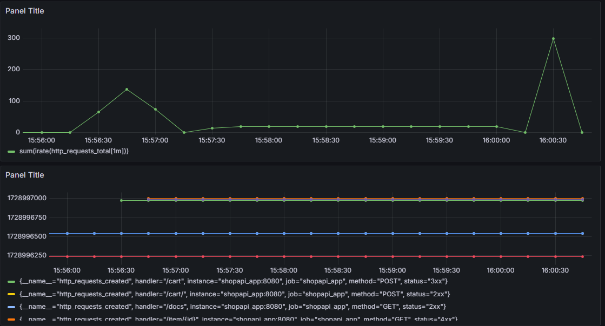

# itmo-python-backend
# ДЗ 3

Интегрировать Docker с Prometheus и Grafana в любой уже написанной ДЗ в сервис.

Сдача через PR.  
Приложить скрин с дашбордами из Grafana.  
- dockerfile для сборки сервиса;  
- docker-compose.yml для локального разворачивания в Docker.

### Решение  
Решение выполнено на базе ДЗ2 (не смотря на то что в ДЗ есть проблемы с выполнением тестов, вся функциональность там присутсвует).  
Ниже представлены несколько скринов из Grafana:

